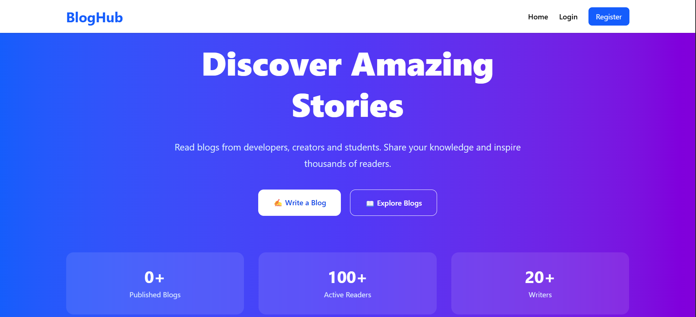
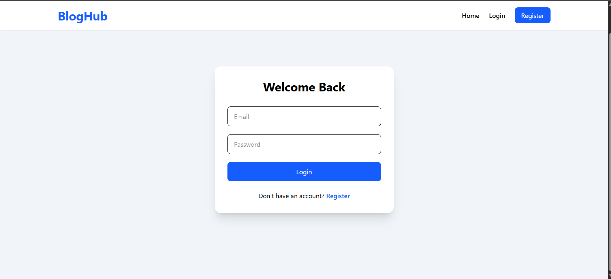
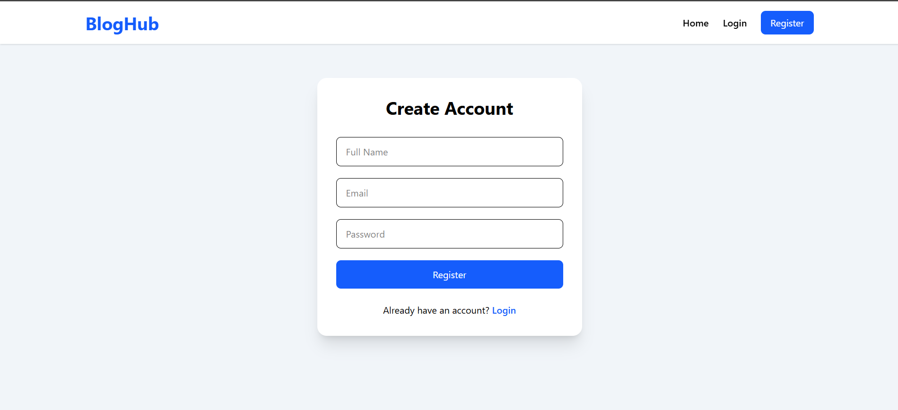
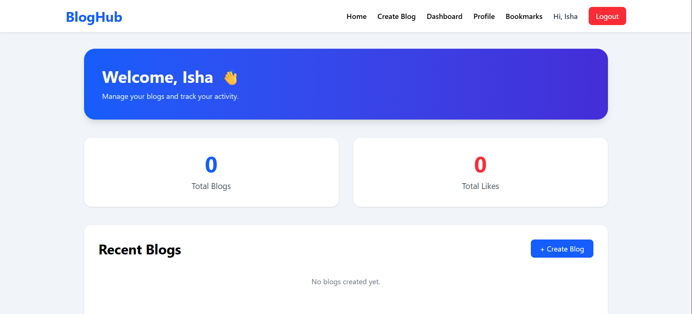
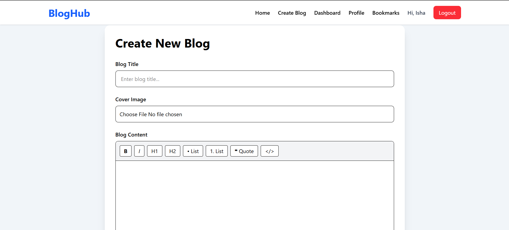
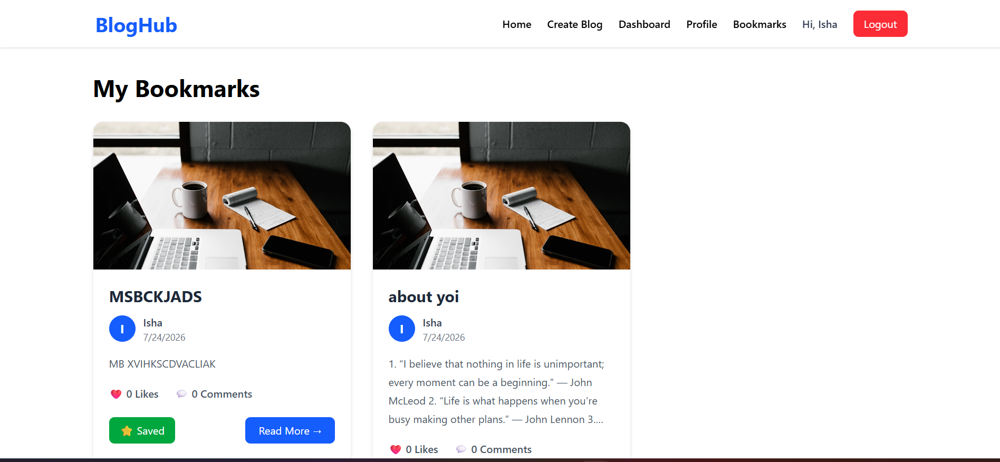
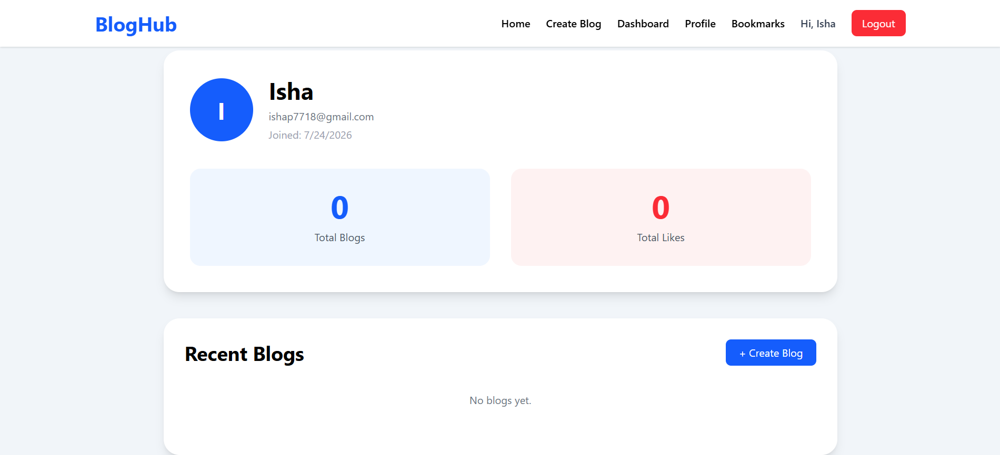

<div align="center">

# 🚀 BlogHub

### Modern Full Stack MERN Blogging Platform

Build, share and explore blogs with a beautiful rich text editor, authentication, image uploads and social features.

<p align="center">


</p>

<p align="center">

<a href="https://blogging-platform-tau-sand.vercel.app">

</a>

<a href="https://blogging-platform-zbnp.onrender.com">

</a>

</p>

</div>

---

# 📖 About

**BlogHub** is a full-stack blogging platform built using the **MERN Stack**. Users can register, log in securely, create blogs with a rich text editor, upload cover images, like posts, bookmark blogs, and manage their own content.

The application is fully responsive and deployed using **Vercel**, **Render**, **MongoDB Atlas**, and **Cloudinary**.

---

# ✨ Features

- 🔐 Secure JWT Authentication
- ✍️ Rich Text Editor (Tiptap)
- 🖼️ Cloudinary Image Upload
- 📝 Create, Edit & Delete Blogs
- ❤️ Like Blogs
- 🔖 Bookmark Blogs
- 👤 User Dashboard
- 📚 My Blogs
- 🔍 Search Blogs
- 📄 Pagination
- 📱 Responsive Design
- ☁️ Fully Deployed

---

# 🛠 Tech Stack

| Frontend | Backend | Database | Deployment |
|----------|----------|-----------|------------|
| React.js | Node.js | MongoDB Atlas | Vercel |
| Vite | Express.js | Mongoose | Render |
| Tailwind CSS | JWT | Cloudinary | GitHub |

---

# 🏗 Architecture

```
React + Vite
      │
   Axios API
      │
Node.js + Express
      │
 JWT Authentication
      │
 MongoDB Atlas
      │
 Cloudinary
```

---

# 📸 Project Screenshots

## 🏠 Home Page



---

## 🔐 Login



---

## 📝 Register



---

## 📊 Dashboard



---

## ✍️ Create Blog



---

## 🔖 Bookmarks



---

## 👤 Profile



---

# 📂 Folder Structure

```
blogging-platform
│
├── client
│   ├── src
│   ├── public
│   └── package.json
│
├── server
│   ├── config
│   ├── controllers
│   ├── middleware
│   ├── models
│   ├── routes
│   └── server.js
│
├── assets
│   └── screenshots
│
└── README.md
```

---

# ⚙️ Installation

### Clone Repository

```bash
git clone https://github.com/Isha4002/blogging-platform.git
```

### Backend

```bash
cd server
npm install
npm run dev
```

### Frontend

```bash
cd client
npm install
npm run dev
```

---

# 🌐 Live Project

### Frontend

https://blogging-platform-tau-sand.vercel.app

### Backend

https://blogging-platform-zbnp.onrender.com

---

# 🚀 Future Improvements

- 🌙 Dark Mode
- 🔔 Notifications
- 👥 Follow Authors
- 🤖 AI Blog Assistant
- 📧 Email Verification
- 📈 Analytics Dashboard

---

# 👩‍💻 Author

## Isha Pal

**GitHub**

https://github.com/Isha4002

---

# ⭐ Support

If you found this project useful, consider giving it a ⭐ on GitHub.

It helps the project reach more developers.

---

<div align="center">

### Thanks for visiting ❤️

Made with MERN Stack 🚀

</div>
